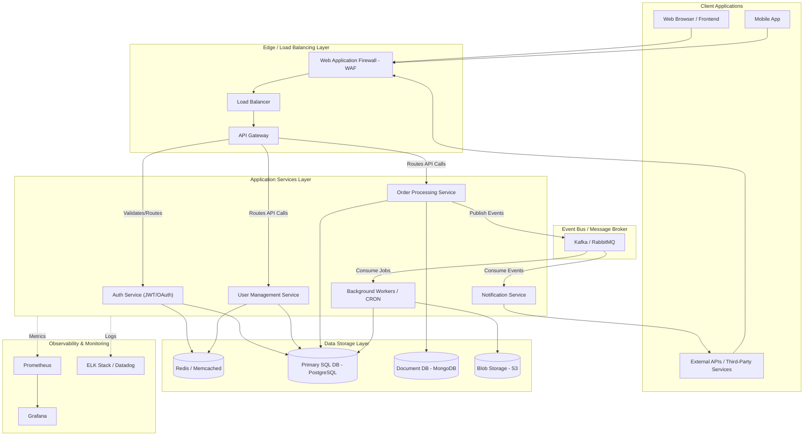

```mermaid
graph TD
    %% Client Layer
    subgraph Client [Client Applications]
        Web[Web Browser / Frontend]
        Mobile[Mobile App]
        ExtAPI[External APIs / Third-Party Services]
    end

    %% Edge/Gateway Layer
    subgraph Edge [Edge / Load Balancing Layer]
        WAF[Web Application Firewall - WAF]
        LB[Load Balancer]
        APIGW[API Gateway]
    end

    %% Application Layer
    subgraph AppLayer [Application Services Layer]
        AuthService["Auth Service (JWT/OAuth)"]
        UserService[User Management Service]
        OrderService[Order Processing Service]
        NotificationService[Notification Service]
        Worker[Background Workers / CRON]
    end

    %% Message Broker / Async Layer
    subgraph MessageLayer [Event Bus / Message Broker]
        Kafka[Kafka / RabbitMQ]
    end

    %% Data Storage Layer
    subgraph DataLayer [Data Storage Layer]
        Cache[(Redis / Memcached)]
        PrimaryDB[(Primary SQL DB - PostgreSQL)]
        NoSQLDB[(Document DB - MongoDB)]
        BlobStorage[(Blob Storage - S3)]
    end

    %% Monitoring & Logging
    subgraph Observability [Observability & Monitoring]
        Prometheus[Prometheus]
        Grafana[Grafana]
        ELK[ELK Stack / Datadog]
    end

    %% Connections
    Web --> WAF
    Mobile --> WAF
    ExtAPI --> WAF

    WAF --> LB
    LB --> APIGW

    APIGW -->|Validates/Routes| AuthService
    APIGW -->|Routes API Calls| UserService
    APIGW -->|Routes API Calls| OrderService

    AuthService --> Cache
    AuthService --> PrimaryDB

    UserService --> Cache
    UserService --> PrimaryDB

    OrderService --> PrimaryDB
    OrderService --> NoSQLDB
    OrderService -->|Publish Events| Kafka

    Kafka -->|Consume Events| NotificationService
    Kafka -->|Consume Jobs| Worker

    NotificationService --> ExtAPI
    Worker --> BlobStorage
    Worker --> PrimaryDB

    AppLayer -.->|Metrics| Prometheus
    AppLayer -.->|Logs| ELK
    Prometheus --> Grafana
```
