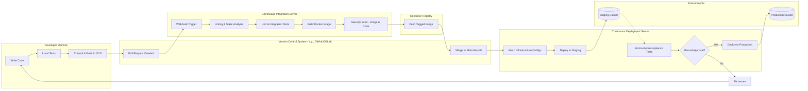

```mermaid
graph LR
    %% Developer Actions
    subgraph Dev [Developer Machine]
        Code[Write Code]
        LocalTest[Local Tests]
        Commit[Commit & Push to VCS]
    end

    %% Source Control
    subgraph VCS [Version Control System - e.g., GitHub/GitLab]
        PR[Pull Request Created]
        Merge[Merge to Main Branch]
    end

    %% Continuous Integration (CI)
    subgraph CI [Continuous Integration Server]
        Trigger[Webhook Trigger]
        Lint[Linting & Static Analysis]
        UnitTest[Unit & Integration Tests]
        Build[Build Docker Image]
        Scan[Security Scan - Image & Code]
    end

    %% Artifact Repository
    subgraph Registry [Container Registry]
        PushImage[Push Tagged Image]
    end

    %% Continuous Deployment (CD)
    subgraph CD [Continuous Deployment Server]
        FetchConfig[Fetch Infrastructure Configs]
        DeployStaging[Deploy to Staging]
        E2ETest[End-to-End/Acceptance Tests]
        ManualApproval{Manual Approval?}
        DeployProd[Deploy to Production]
    end

    %% Environments
    subgraph Envs [Environments]
        StagingEnv[(Staging Cluster)]
        ProdEnv[(Production Cluster)]
    end

    %% Flow
    Code --> LocalTest
    LocalTest --> Commit
    Commit --> PR
    PR --> Trigger

    Trigger --> Lint
    Lint --> UnitTest
    UnitTest --> Build
    Build --> Scan
    Scan --> PushImage

    PushImage --> Merge
    Merge --> FetchConfig

    FetchConfig --> DeployStaging
    DeployStaging --> StagingEnv
    StagingEnv -.-> E2ETest
    E2ETest --> ManualApproval

    ManualApproval -->|Yes| DeployProd
    ManualApproval -->|No| Fix[Fix Issues]
    Fix --> Code

    DeployProd --> ProdEnv
```
