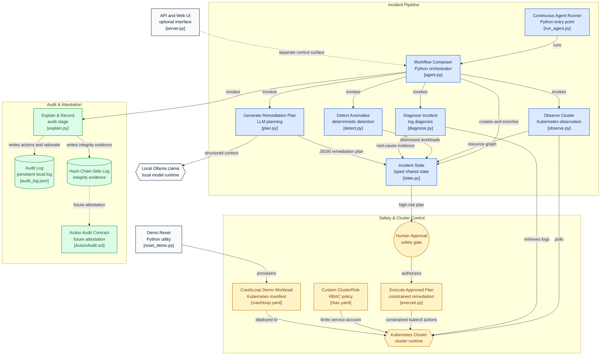

```mermaid
flowchart TD

subgraph group_pipeline["Incident Pipeline"]
  node_main_runner["Continuous Agent Runner<br/>Python entry point<br/>[run_agent.py]"]
  node_agent["Workflow Composer<br/>Python orchestrator<br/>[agent.py]"]
  node_state["Incident State<br/>typed shared state<br/>[state.py]"]
  node_observe["Observe Cluster<br/>Kubernetes observation<br/>[observe.py]"]
  node_detect["Detect Anomalies<br/>deterministic detection<br/>[detect.py]"]
  node_diagnose["Diagnose Incident<br/>log diagnosis<br/>[diagnose.py]"]
  node_plan["Generate Remediation Plan<br/>LLM planning<br/>[plan.py]"]
end

subgraph group_control["Safety &amp; Cluster Control"]
  node_execute["Execute Approved Plan<br/>constrained remediation<br/>[execute.py]"]
  node_cluster{{"Kubernetes Cluster<br/>cluster runtime"}}
  node_rbac["Custom ClusterRole<br/>RBAC policy<br/>[rbac.yaml]"]
  node_approval(("Human Approval<br/>safety gate"))
  node_demo_workload["CrashLoop Demo Workload<br/>Kubernetes manifest<br/>[crashloop.yaml]"]
end

subgraph group_audit["Audit &amp; Attestation"]
  node_explain["Explain &amp; Record<br/>audit stage<br/>[explain.py]"]
  node_audit_log[("Audit Log<br/>persistent local log<br/>[audit_log.json]")]
  node_side_log[("Hash-Chain Side Log<br/>integrity evidence")]
  node_contract["Action Audit Contract<br/>future attestation<br/>[ActionAudit.sol]"]
end

node_ollama{{"Local Ollama Llama<br/>local model runtime"}}
node_api_ui["API and Web UI<br/>optional interface<br/>[server.py]"]
node_demo_reset["Demo Reset<br/>Python utility<br/>[reset_demo.py]"]

node_main_runner -->|"runs"| node_agent
node_agent -->|"creates and enriches"| node_state
node_agent -->|"invokes"| node_observe
node_observe -->|"polls"| node_cluster
node_observe -->|"resource graph"| node_state
node_agent -->|"invokes"| node_detect
node_detect -->|"distressed workloads"| node_state
node_agent -->|"invokes"| node_diagnose
node_diagnose -->|"retrieves logs"| node_cluster
node_diagnose -->|"root-cause evidence"| node_state
node_agent -->|"invokes"| node_plan
node_plan -->|"structured context"| node_ollama
node_plan -->|"JSON remediation plan"| node_state
node_state -->|"high-risk plan"| node_approval
node_approval -->|"authorizes"| node_execute
node_execute -->|"constrained kubectl actions"| node_cluster
node_rbac -->|"limits service account"| node_cluster
node_agent -->|"invokes"| node_explain
node_explain -->|"writes actions and rationale"| node_audit_log
node_explain -->|"writes integrity evidence"| node_side_log
node_side_log -.->|"future attestation"| node_contract
node_api_ui -.->|"separate control surface"| node_agent
node_demo_reset -->|"provisions"| node_demo_workload
node_demo_workload -->|"deployed to"| node_cluster

click node_main_runner "https://github.com/lazydeveloper9/kuber/blob/main/run_agent.py"
click node_agent "https://github.com/lazydeveloper9/kuber/blob/main/agent.py"
click node_state "https://github.com/lazydeveloper9/kuber/blob/main/core/state.py"
click node_observe "https://github.com/lazydeveloper9/kuber/blob/main/core/observe.py"
click node_detect "https://github.com/lazydeveloper9/kuber/blob/main/core/detect.py"
click node_diagnose "https://github.com/lazydeveloper9/kuber/blob/main/core/diagnose.py"
click node_plan "https://github.com/lazydeveloper9/kuber/blob/main/core/plan.py"
click node_execute "https://github.com/lazydeveloper9/kuber/blob/main/core/execute.py"
click node_explain "https://github.com/lazydeveloper9/kuber/blob/main/core/explain.py"
click node_rbac "https://github.com/lazydeveloper9/kuber/blob/main/manifests/rbac.yaml"
click node_audit_log "https://github.com/lazydeveloper9/kuber/blob/main/audit_log.json"
click node_side_log "https://github.com/lazydeveloper9/kuber/blob/main/audit_side_db.jsonl"
click node_contract "https://github.com/lazydeveloper9/kuber/blob/main/contracts/ActionAudit.sol"
click node_api_ui "https://github.com/lazydeveloper9/kuber/blob/main/server.py"
click node_demo_workload "https://github.com/lazydeveloper9/kuber/blob/main/manifests/crashloop.yaml"
click node_demo_reset "https://github.com/lazydeveloper9/kuber/blob/main/reset_demo.py"

classDef toneNeutral fill:#f8fafc,stroke:#334155,stroke-width:1.5px,color:#0f172a
classDef toneBlue fill:#dbeafe,stroke:#2563eb,stroke-width:1.5px,color:#172554
classDef toneAmber fill:#fef3c7,stroke:#d97706,stroke-width:1.5px,color:#78350f
classDef toneMint fill:#dcfce7,stroke:#16a34a,stroke-width:1.5px,color:#14532d
classDef toneRose fill:#ffe4e6,stroke:#e11d48,stroke-width:1.5px,color:#881337
classDef toneIndigo fill:#e0e7ff,stroke:#4f46e5,stroke-width:1.5px,color:#312e81
classDef toneTeal fill:#ccfbf1,stroke:#0f766e,stroke-width:1.5px,color:#134e4a
class node_main_runner,node_agent,node_state,node_observe,node_detect,node_diagnose,node_plan toneBlue
class node_execute,node_cluster,node_rbac,node_approval,node_demo_workload toneAmber
class node_explain,node_audit_log,node_side_log,node_contract toneMint
class node_ollama,node_api_ui,node_demo_reset toneNeutral
```
